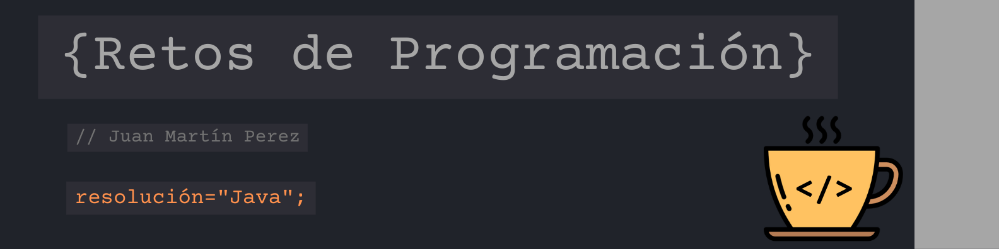

*Desafíos para mejorar las habilidades en lógica de programación y dominar los fundamentos de Java.*

<hr>

### ✔️ Reto 1: "FIZZ BUZZ"

```
Escribe un programa que muestre por consola los números de 1 a 100 (ambos incluidos y con un salto de línea entre cada impresión), sustituyendo los siguientes:

* Múltiplos de 3 por la palabra "FIZZ".
* Múltiplos de 5 por la palabra "BUZZ".
* Múltiplos de 3 y de 5 a la vez por la palabra "FIZZBUZZ".
```
<hr>

### ✔️ Reto 2: "ANAGRAMA"

```
Escribe una función que reciba dos String y retorne verdadero o falso según sean o no anagramas:

 * Un Anagrama consiste en formar una palabra reordenando las letras de otra palabra inicial.
 * NO hace falta comprobar que ambas palabras existan.
```